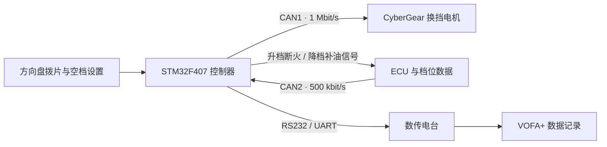

# HQU CZCD E-Shift

[](LICENSE)
[](1_SoftWare/Eshift_byCyberMotor_F407)
[](#项目状态)

华侨大学承志车队面向学生方程式赛车开发的电控换挡系统。项目以 STM32F407 为控制核心，通过双 CAN 总线连接 ECU 与 CyberGear 关节电机，并包含配套 PCB、机械结构和实车验证记录。

> [!IMPORTANT]
> 当前主分支的仓库结构、README 与 `docs` 文档由 OpenAI Codex 基于原始工程、开发记录和已有 README 协助修改、整理。核心固件控制逻辑、PCB、机械设计及原始工程成果来自项目作者和车队成员。AI 整理未替代编译、台架与实车验证，相关说明可能存在理解或表述错误；使用固件、硬件或安全相关内容前，请结合源码和实物重新核对。
>
> 开源化整理前的完整版本可查看 [GitHub 提交 `0a7fb9e`](https://github.com/Saturday-365/E-Shift-CZCD/commit/0a7fb9e37e109e1c96eb0db8fb1200f69377ce26)。

> [!WARNING]
> 本项目涉及车辆动力系统与执行机构控制。首次使用必须在断开发动机动力的台架环境中完成方向、限位、急停和失效保护验证。未经验证，请勿直接用于行驶车辆。

## 适用范围与复刻边界

本仓库适合用于学习和复用以下内容：

- STM32F407 双 CAN 电控系统的工程组织方式。
- CyberGear 位置模式控制、反馈解析与参数设置。
- 方向盘拨片输入、档位稳定处理和换挡动作编排。
- ECU 数据接收、断火/补油接口与数传调试链路。
- 学生方程式赛车项目从台架测试到实车迭代的工程记录。

本仓库不是可直接装车的通用换挡控制器。ECU 协议、机械行程、电机零位、换挡角度、速度、扭矩和超时参数均与原车配置相关。复刻者应先完成编译和报文模拟，再进行电机空载、机构台架和车辆低能量测试，不能直接沿用当前参数上车。

<table>
  <tr>
    <td align="center"><br>换挡机构</td>
    <td align="center"><br>电控离合机构</td>
  </tr>
</table>

## 项目特点

- STM32F407VET6 主控，主频 168 MHz。
- CAN1 以 1 Mbit/s 控制 CyberGear 换挡电机。
- CAN2 以 500 kbit/s 接收 ECU 数据。
- 支持拨片输入、升降档输出、档位稳定处理和换挡超时退出。
- 支持通过 RS232/数传电台向 VOFA+ 回传调试数据。
- 同时公开固件、嘉立创 EDA 工程、Fusion 360 模型以及开发记录中的实车验证过程。
- README 与开发日志保留故障原因和迭代过程，而不只展示最终结果。

## 项目状态

| 模块 | 状态 | 说明 |
| --- | --- | --- |
| F407 主固件 | 已实车使用 | 当前唯一维护的主工程 |
| CyberGear 换挡电机 | 已实车使用 | 位置模式，按档位使用不同换挡角度 |
| 档位稳定处理 | 已实现 | 用于过滤换挡过程中短暂出现的空档数据 |
| 升档断火、降档补油接口 | 已实现但比赛时关闭 | 受 ECU 固件、档位信号和调试时间限制 |
| 电控离合 | 实验功能 | 主流程中暂未启用 |
| 力矩突变识别档位 | 方案阶段 | 尚未实现和验证，不应视为现有功能 |
| 非阻塞换挡状态机 | 待开发 | 当前换挡流程仍包含阻塞式等待 |

项目的已知限制、实验方案和后续计划见 [开发记录](docs/development-log.md)。

## 系统架构



### 主要接口

| 接口 | 当前用途 | 当前配置 |
| --- | --- | --- |
| CAN1 | CyberGear 换挡电机 | 1 Mbit/s，PA11 RX、PA12 TX |
| CAN2 | ECU 数据接收 | 500 kbit/s，PB12 RX、PB13 TX |
| USART3 | RS232/数传电台 | PD8 TX、PD9 RX |
| PE9 | 方向盘升档输入 | GPIO 输入 |
| PB1 | 方向盘降档输入 | GPIO 输入 |
| PB0 | 手动重置为空档 | GPIO 输入 |
| PB4 | ECU 升档断火请求 | 高电平触发 |
| PB5 | ECU 降档补油请求 | 高电平触发 |

当前 ECU CAN2 过滤器接收全部报文，数据解析主要依据数据区中的通道编号，并未在业务代码中限定仲裁 ID。接入其他车辆总线前，必须根据目标 ECU 协议增加准确的 CAN ID、帧格式、发送周期和超时校验。

详细的数据流、引脚和换挡流程见 [系统架构说明](docs/architecture.md)。

## 快速开始

### 1. 获取仓库

```bash
git clone https://github.com/Saturday-365/E-Shift-CZCD.git
cd E-Shift-CZCD
```

默认从 `master` 的最新提交开始。`1_SoftWare/Eshift_byCyberMotor_F407` 是当前唯一维护的主固件；`1_SoftWare/legacy` 仅用于追溯早期方案，不作为复刻入口。

### 2. 开发环境

| 项目 | 当前工程记录 |
| --- | --- |
| MCU | STM32F407VET6 |
| STM32CubeMX | 6.12.0 |
| STM32CubeF4 | V1.28.1 |
| Keil MDK 编译器 | ARMCC V5.06 Update 7 Build 960 |
| Keil Device Pack | `Keil.STM32F4xx_DFP.2.17.1` |

上述开发工具和 Device Pack 不包含在仓库中，需要从相应厂商渠道安装。当前项目只维护 Keil MDK 工程，尚未提供 GCC/CMake、PlatformIO 或自动化构建配置。

### 3. 打开主工程

- CubeMX 配置：[STM32F407VET6_CUBMX.ioc](1_SoftWare/Eshift_byCyberMotor_F407/STM32F407VET6_CUBMX.ioc)
- Keil 工程：[STM32F407VET6_CUBMX.uvprojx](1_SoftWare/Eshift_byCyberMotor_F407/MDK-ARM/STM32F407VET6_CUBMX.uvprojx)
- 主程序：[main.c](1_SoftWare/Eshift_byCyberMotor_F407/Core/Src/main.c)
- 换挡逻辑：[SA_E_Shift.c](1_SoftWare/Eshift_byCyberMotor_F407/Sourse_Library/1_SA_Library/SA_E_Shift.c)

如需适配其他硬件，请在 STM32CubeMX 中自行修改外设、时钟与引脚配置后重新生成工程，不要直接手改 CubeMX 生成的外设初始化代码。

### 4. 核对车辆相关配置

首次编译前应检查 [SA_E_Shift.c](1_SoftWare/Eshift_byCyberMotor_F407/Sourse_Library/1_SA_Library/SA_E_Shift.c) 中的参数：

| 参数 | 当前工程值 | 复刻时必须确认 |
| --- | --- | --- |
| 换挡电机 CAN ID | `0x01` | 与实际电机 ID 一致，且总线上没有冲突 |
| 电机控制模式 | 位置模式 | 电机固件支持对应协议与模式 |
| 升档角度 | `-47, 58, 45, 49, 41, 47` | 按各档机械行程重新标定 |
| 降档角度 | `37, -45, -45, -38, -38, -38` | 按各档机械行程重新标定 |
| 换挡速度限制 | `100` | 单位和安全范围以当前驱动及电机协议为准 |
| 换挡扭矩限制 | `10` | 单位和安全范围以当前驱动及电机协议为准 |
| 换挡超时计数 | `20` | 结合 TIM2 的实际中断周期换算 |
| 升档/降档等待计数 | `0 / 0` | 当前比赛配置未启用等待 |

`Motor_Init()` 会在上电初始化时把换挡电机的当前位置设置为零位。只有在机构处于已确认的安全基准位置时才能执行该流程，否则可能造成零位错误、反向运动或撞击机械限位。

> [!CAUTION]
> 当前 TIM2 配置在 168 MHz 系统时钟、APB1 为 42 MHz 时约每 100 ms 更新一次超时计数，而部分源码注释仍写作 50 ms。修改 `errtime`、`Shift_wait` 或 `Down_wait` 前，应以 `.ioc`、`tim.c` 和实测节拍为准，不能只按旧注释换算。

### 5. 编译与上电

1. 安装上表对应的 Keil Device Pack。
2. 打开 `.uvprojx`，确认目标为 `STM32F407VETx`。
3. 执行完整编译，确认没有错误或警告，再通过 SWD 烧录。
4. 首次启动时不连接换挡拉杆和 ECU，只检查控制器供电、指示灯与串口输出。
5. 固定电机并设置保守的速度、扭矩和电源限流，确认 ID、方向、当前位置及零位行为。
6. 使用 CAN 工具模拟 ECU 档位报文，验证非法数据、报文中断和超时情况下不会持续输出。
7. 连接换挡机构但保持发动机停机，逐档标定行程并检查机械限位。
8. 确认急停可以独立切断执行器电源后，再进行车辆低能量单次换挡测试。

更完整的检查步骤见 [构建与台架验证](docs/getting-started.md)。

### 6. 外部依赖

| 对象 | 仓库提供内容 | 复刻者需要自行准备 |
| --- | --- | --- |
| CyberGear | CAN 控制与反馈解析代码 | 电机、通信协议核对、正确固件和初始 ID 配置 |
| ECU | 当前车辆的数据解析代码 | 目标 ECU 的 CAN 定义、报文源或 CAN 仿真工具 |
| 数传调试 | 串口数据发送代码与字段说明 | AS32-DTU-1W 或其他串口链路、VOFA+ |
| 下载调试 | Keil 工程与 SWD 接口 | ST-Link/DAP、驱动和可靠供电 |

历史厂商工具和手册因许可证与版本问题未直接放入仓库，相关资料类型见 [外部资料索引](4_Document/README.md)。

## 仓库结构

```text
1_SoftWare/
├─ Eshift_byCyberMotor_F407/   # 当前主工程
└─ legacy/                     # F103 与早期基础测试工程
2_HardWare/                    # 嘉立创 EDA PCB 工程
3_3DProject/                   # Fusion 360 机械模型
4_Document/                    # 第三方设备资料索引，不内置厂商软件
docs/                          # 构建、架构、日志与协作文档
images/README/                 # README 图片
```

软件版本说明见 [1_SoftWare/README.md](1_SoftWare/README.md)。

## 硬件与机械

硬件迭代包含 STM32F407 核心板与集成板 V1.0、V2.0、V3.1。集成板使用模块化 CAN 收发器和 RS232 转 TTL 模块，以降低焊接与调试不确定性。

机械部分包含：

- 换挡电机支架与离合电机支架。
- 金属 3D 打印电机输出轴。
- 换挡拉杆和离合拉线盘。
- 方向盘拨片配套结构与线束。

<table>
  <tr>
    <td align="center"><br>V2.0 集成板</td>
    <td align="center"><br>V3.1 集成板</td>
    <td align="center"><br>换挡电机输出轴</td>
  </tr>
</table>

当前仓库主要提供原始设计工程。生产文件导出情况及使用限制见 [硬件与机械说明](docs/hardware.md)。

## 测试与验证

历史台架与出车 CSV 已从主分支移除，以控制仓库体积并避免发布缺少完整元数据的数据。需要追溯时，可从开源化整理前的 [GitHub 提交 `0a7fb9e`](https://github.com/Saturday-365/E-Shift-CZCD/commit/0a7fb9e37e109e1c96eb0db8fb1200f69377ce26) 查看。

比赛日记录显示，车辆在湿地直线加速项目中完成 4.73 s 和 4.75 s 成绩。该成绩是整车表现记录，不应单独视为换挡系统性能指标。

当前主分支没有预编译固件、自动化测试或可直接用于回归验证的 CSV 样例。复刻结果至少应记录固件提交、工具链版本、电机与 ECU 配置、测试条件、原始数据和异常现象，不能仅以“电机发生动作”作为成功标准。

后续测试的记录字段、命名方式与公开要求见 [测试记录规范](docs/testing.md)。

## 已知问题

- 当前换挡动作使用阻塞式流程，不适合在主循环中同时承载更多实时任务。
- 不同档位的换挡角度、等待时间和扭矩限制仍是车辆相关参数。
- ECU CAN 报文格式与当前车辆绑定，尚未提供可直接运行的 ECU 仿真样例。
- 当前业务逻辑没有完整实现 CAN 数据新鲜度、电机错误码和过温联锁保护。
- 档位传感器在换挡过程中会短暂经过空档，真实空档目前需要人工设置。
- 电机刚性安装在发动机附近时存在过温风险。
- V3 PCB 曾出现 CAN 收发器接地不良，后续通过返修和 V3.1 迭代处理。
- 电控离合会带来明显电池压降，且离合恢复时机不当可能导致后轮转速突变。

## 参与贡献

欢迎围绕以下方向提交 Issue 或 Pull Request：

- 非阻塞换挡状态机。
- 档位识别与力矩突变检测。
- CAN 丢帧、过温和传感器异常保护。
- 测试记录工具、数据解析与可视化。
- GCC/CMake 构建与持续集成。
- PCB、机械结构和线束的可制造性改进。

提交前请阅读 [CONTRIBUTING.md](CONTRIBUTING.md)。车辆安全相关问题请按 [SECURITY.md](SECURITY.md) 中的方式反馈。

## 许可证与第三方内容

仓库根目录当前使用 [GNU GPL-3.0](LICENSE)。STM32 HAL、CMSIS 和其他第三方内容仍受其各自许可证约束，详情见 [THIRD_PARTY.md](THIRD_PARTY.md)。

硬件、机械设计和文档的独立许可证仍在整理中。在许可证范围明确前，请勿假定第三方手册、软件或厂商固件可自由再分发。

## 致谢

感谢 HQU-13、HQU-14 车组成员以及林哥、泉哥、保罗、嘉辉对系统设计、加工、调试和实车验证的帮助。

相关项目：[华侨大学承志赛车队电子节气门安全规则与 BSPD 模块](https://github.com/Saturday-365/ECT-BSPD_HQU_CZCD)
