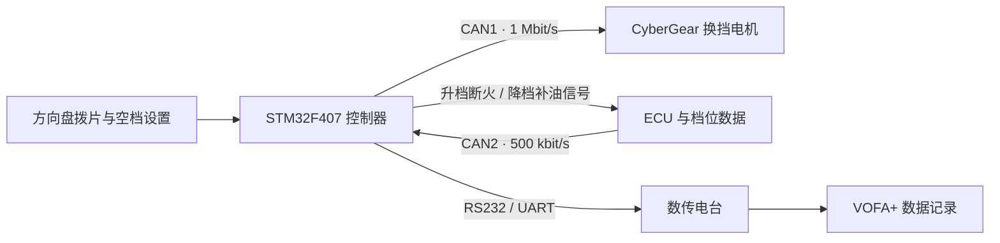

# HQU CZCD E-Shift

[](LICENSE)
[](1_SoftWare/Eshift_byCyberMotor_F407)
[](#项目状态)

华侨大学承志车队面向学生方程式赛车开发的电控换挡系统。项目以 STM32F407 为控制核心，通过双 CAN 总线连接 ECU 与 CyberGear 关节电机，并包含配套 PCB、机械结构和实车测试数据。

> [!WARNING]
> 本项目涉及车辆动力系统与执行机构控制。首次使用必须在断开发动机动力的台架环境中完成方向、限位、急停和失效保护验证。未经验证，请勿直接用于行驶车辆。

<table>
  <tr>
    <td align="center"><br>换挡机构</td>
    <td align="center"><br>电控离合机构</td>
  </tr>
</table>

## 项目特点

- STM32F407VET6 主控，主频 168 MHz。
- CAN1 以 1 Mbit/s 控制 CyberGear 换挡电机。
- CAN2 以 500 kbit/s 接收 ECU 数据。
- 支持拨片输入、升降档输出、档位稳定处理和换挡超时退出。
- 支持通过 RS232/数传电台向 VOFA+ 回传调试数据。
- 同时公开固件、嘉立创 EDA 工程、Fusion 360 模型和实车测试记录。
- README 与开发日志保留故障原因和迭代过程，而不只展示最终结果。

## 项目状态

| 模块 | 状态 | 说明 |
| --- | --- | --- |
| F407 主固件 | 已实车使用 | 当前唯一维护的主工程 |
| CyberGear 换挡电机 | 已实车使用 | 位置模式，按档位使用不同换挡角度 |
| 档位稳定处理 | 已实现 | 用于过滤换挡过程中短暂出现的空档数据 |
| 升档断火、降档补油接口 | 已实现但比赛时关闭 | 受 ECU 固件、档位信号和调试时间限制 |
| 电控离合 | 实验功能 | 主流程中暂未启用 |
| 力矩突变识别档位 | 方案阶段 | 尚未实现和验证，不应视为现有功能 |
| 非阻塞换挡状态机 | 待开发 | 当前换挡流程仍包含阻塞式等待 |

项目的已知限制、实验方案和后续计划见 [开发记录](docs/development-log.md)。

## 系统架构



详细的数据流、引脚和换挡流程见 [系统架构说明](docs/architecture.md)。

## 快速开始

### 1. 开发环境

| 项目 | 当前工程记录 |
| --- | --- |
| MCU | STM32F407VET6 |
| STM32CubeMX | 6.12.0 |
| STM32CubeF4 | V1.28.1 |
| Keil MDK 编译器 | ARMCC V5.06 Update 7 Build 960 |
| Keil Device Pack | `Keil.STM32F4xx_DFP.2.17.1` |

### 2. 打开主工程

- CubeMX 配置：[STM32F407VET6_CUBMX.ioc](1_SoftWare/Eshift_byCyberMotor_F407/STM32F407VET6_CUBMX.ioc)
- Keil 工程：[STM32F407VET6_CUBMX.uvprojx](1_SoftWare/Eshift_byCyberMotor_F407/MDK-ARM/STM32F407VET6_CUBMX.uvprojx)
- 主程序：[main.c](1_SoftWare/Eshift_byCyberMotor_F407/Core/Src/main.c)
- 换挡逻辑：[SA_E_Shift.c](1_SoftWare/Eshift_byCyberMotor_F407/Sourse_Library/1_SA_Library/SA_E_Shift.c)

如需适配其他硬件，请在 STM32CubeMX 中自行修改外设、时钟与引脚配置后重新生成工程，不要直接手改 CubeMX 生成的外设初始化代码。

### 3. 编译与上电

1. 安装上表对应的 Keil Device Pack。
2. 打开 `.uvprojx`，确认目标为 `STM32F407VETx`。
3. 编译并通过 SWD 烧录。
4. 断开发动机动力，在台架上确认换挡电机方向、零位和机械限位。
5. 核对 CAN 波特率、电机 ID、终端电阻及 ECU 数据格式。
6. 先验证急停与超时退出，再进行低能量单次换挡测试。

更完整的检查步骤见 [构建与台架验证](docs/getting-started.md)。

## 仓库结构

```text
1_SoftWare/
├─ Eshift_byCyberMotor_F407/   # 当前主工程
└─ legacy/                     # F103 与早期基础测试工程
2_HardWare/                    # 嘉立创 EDA PCB 工程
3_3DProject/                   # Fusion 360 机械模型
4_Document/                    # 项目报告与待整理的第三方资料
5_TestData/                    # VOFA+ 实车和台架数据
docs/                          # 构建、架构、日志与协作文档
images/README/                 # README 图片
```

软件版本说明见 [1_SoftWare/README.md](1_SoftWare/README.md)。

## 硬件与机械

硬件迭代包含 STM32F407 核心板与集成板 V1.0、V2.0、V3.1。集成板使用模块化 CAN 收发器和 RS232 转 TTL 模块，以降低焊接与调试不确定性。

机械部分包含：

- 换挡电机支架与离合电机支架。
- 金属 3D 打印电机输出轴。
- 换挡拉杆和离合拉线盘。
- 方向盘拨片配套结构与线束。

<table>
  <tr>
    <td align="center"><br>V2.0 集成板</td>
    <td align="center"><br>V3.1 集成板</td>
    <td align="center"><br>换挡电机输出轴</td>
  </tr>
</table>

当前仓库主要提供原始设计工程。生产文件导出情况及使用限制见 [硬件与机械说明](docs/hardware.md)。

## 测试与验证

`5_TestData` 保存了台架及出车时通过 VOFA+ 记录的数据。数据包含电机位置、力矩、温度、档位、目标档位、ECU 电压、转速、油门开度和水温等字段。

比赛日记录显示，车辆在湿地直线加速项目中完成 4.73 s 和 4.75 s 成绩。该成绩是整车表现记录，不应单独视为换挡系统性能指标。

数据字段、采样条件与可复现要求见 [测试数据说明](docs/test-data.md)。

## 已知问题

- 当前换挡动作使用阻塞式流程，不适合在主循环中同时承载更多实时任务。
- 不同档位的换挡角度、等待时间和扭矩限制仍是车辆相关参数。
- 档位传感器在换挡过程中会短暂经过空档，真实空档目前需要人工设置。
- 电机刚性安装在发动机附近时存在过温风险。
- V3 PCB 曾出现 CAN 收发器接地不良，后续通过返修和 V3.1 迭代处理。
- 电控离合会带来明显电池压降，且离合恢复时机不当可能导致后轮转速突变。

## 参与贡献

欢迎围绕以下方向提交 Issue 或 Pull Request：

- 非阻塞换挡状态机。
- 档位识别与力矩突变检测。
- CAN 丢帧、过温和传感器异常保护。
- 测试数据解析与可视化。
- GCC/CMake 构建与持续集成。
- PCB、机械结构和线束的可制造性改进。

提交前请阅读 [CONTRIBUTING.md](CONTRIBUTING.md)。车辆安全相关问题请按 [SECURITY.md](SECURITY.md) 中的方式反馈。

## 许可证与第三方内容

仓库根目录当前使用 [GNU GPL-3.0](LICENSE)。STM32 HAL、CMSIS 和其他第三方内容仍受其各自许可证约束，详情见 [THIRD_PARTY.md](THIRD_PARTY.md)。

硬件、机械设计和文档的独立许可证仍在整理中。在许可证范围明确前，请勿假定第三方手册、软件或厂商固件可自由再分发。

## 致谢

感谢 HQU-13、HQU-14 车组成员以及林哥、泉哥、保罗、嘉辉对系统设计、加工、调试和实车验证的帮助。

相关项目：[华侨大学承志赛车队电子节气门安全规则与 BSPD 模块](https://github.com/Saturday-365/ECT-BSPD_HQU_CZCD)
