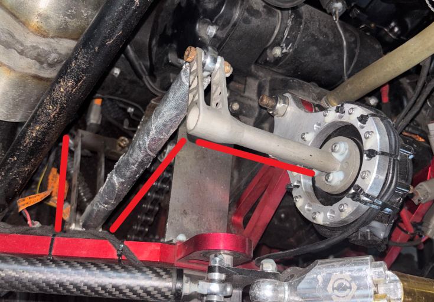
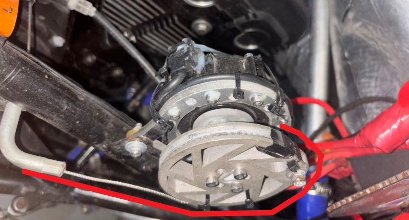
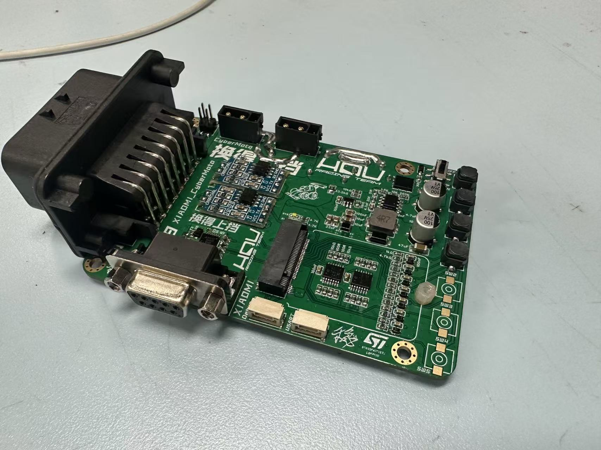
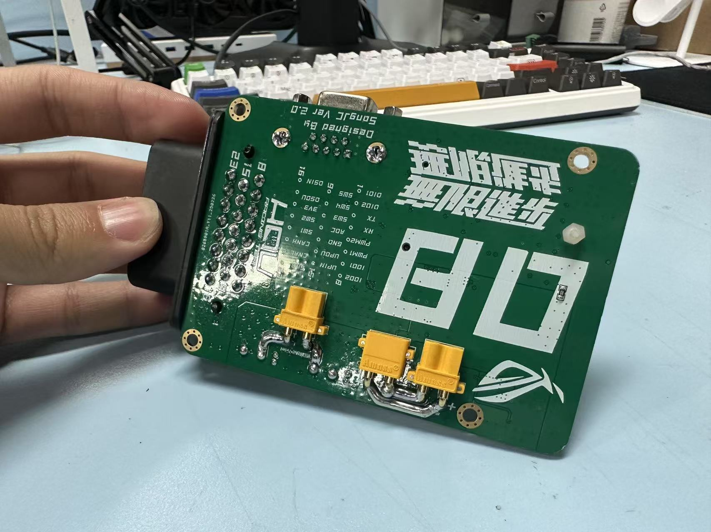
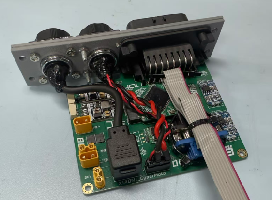
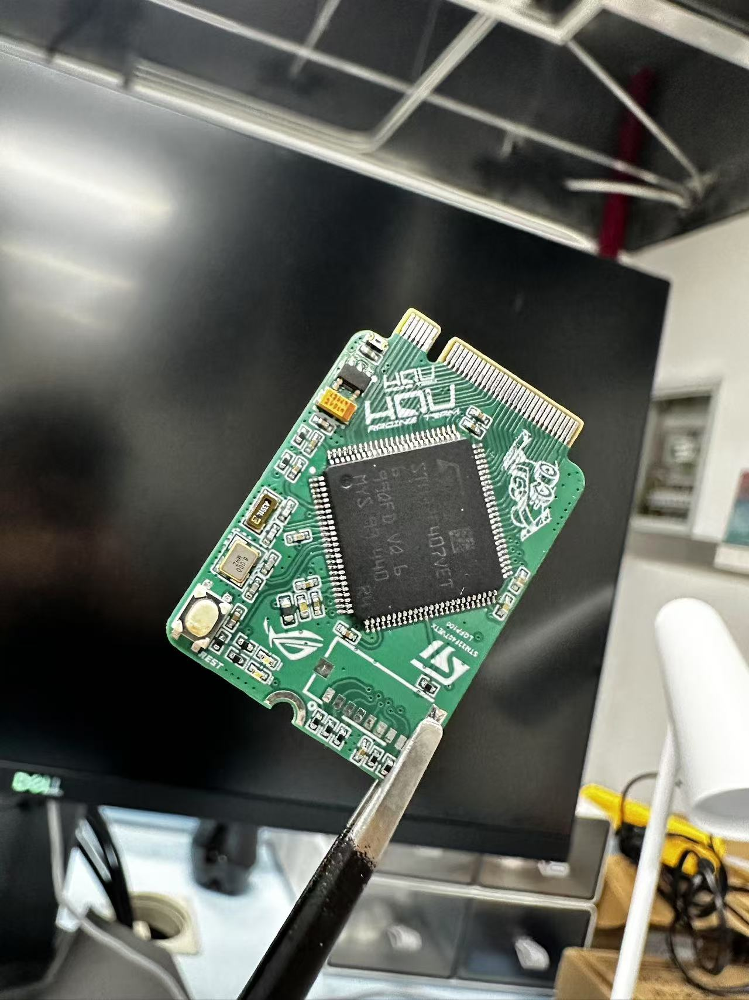
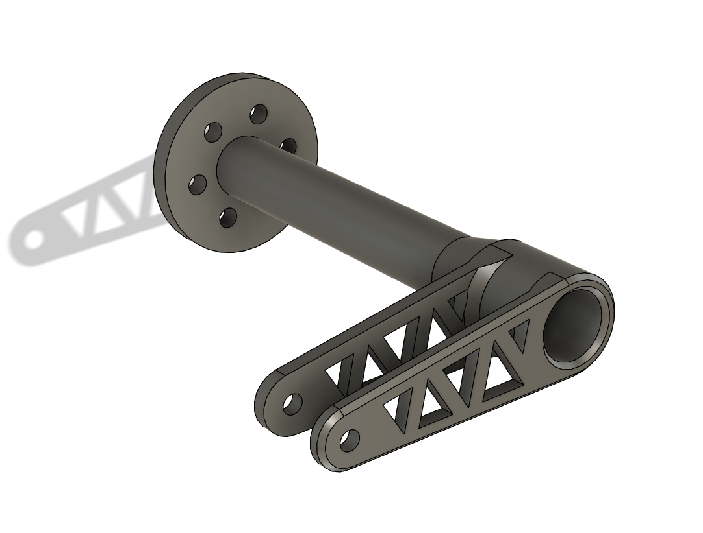
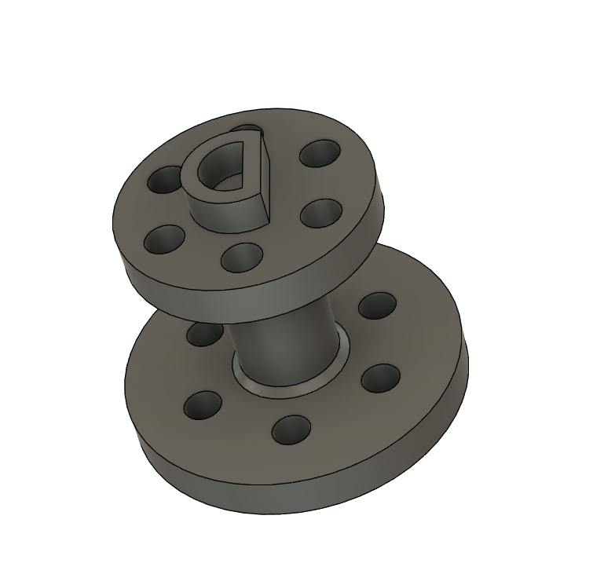
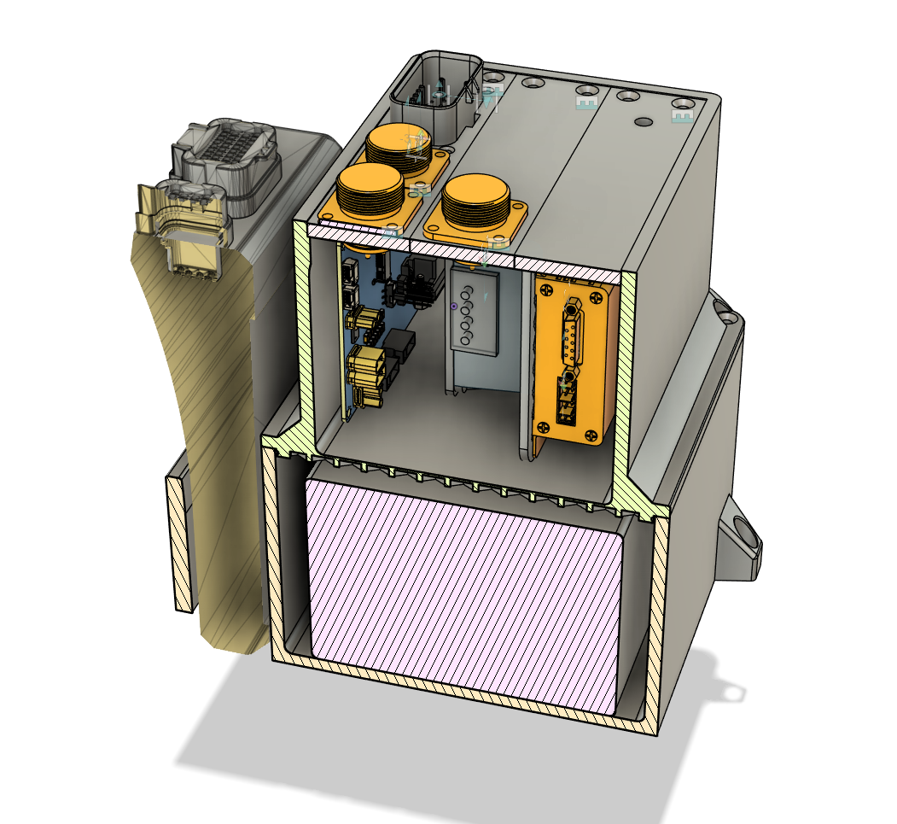
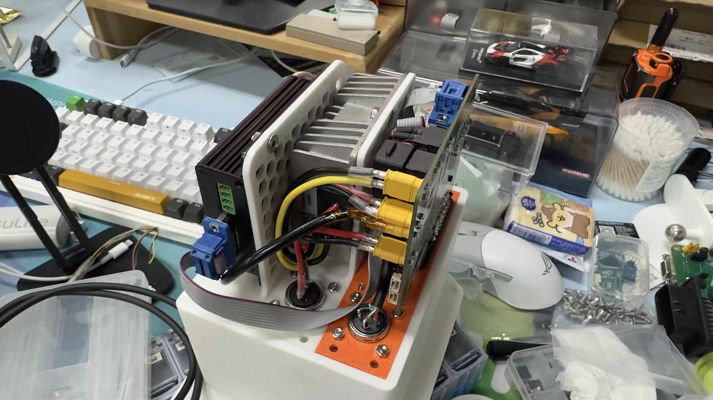

# 华侨大学承志车队2025赛季电控换挡系统

20251224更新了最新写的电控换挡报告，涵盖了主要算法的流程图，也对算法和其余部分进行了解释，有助于各位理解本套系统（非纯手敲，注意辨别AI错误），文件位于4_DOCUMENT  

寒假期间考虑增加一版cmake编译环境的源码工程，以适配各种stm32开发环境，敬请期待 

还没研究透github markdown语法，图片显示有点奇怪，见谅
## 换挡机构示意
<div style="display: flex; gap: 20px; justify-content: center;">
  <figure>
    
    <br>
    <div style="color:orange;
    display: inline-block;
    color: #999;
    padding: 2px;">换挡机构</div>
</figure>
<figure>
    
    <br>
    <div style="color:orange;
    display: inline-block;
    color: #999;
    padding: 2px;">电控离合</div>
</figure>
</div>

## 注意事项
临时更新，想到哪里说哪里了
1. **20251104**选择关节电机时注意“温度保护”这一参数，比如小米电机他的过温保护为80度，在我们的测试过程中，由于电机刚性链接在发动机支架上，导致在高压缩比发动机的温度下，发生过过热的现象，所以在设计电机的安装方式及安装位置时，应当充分考虑温度相关参数

## 代码框架

本代码外设使用情况

* 定时器两个
  * 按键扫描
  * 各种非阻塞式延时控制
* CAN通道两个
  * 一个为ECU数据链
  * 一个为小米关节电机控制链
* 中断
  * can接受中断用于接受关节电机回传信号及ECU侧发送的信号，在can中断回调函数中进行数据的处理，用结构体进行数据的内部传输
    *（待完善）*

## 目前瓶颈及未来优化方向

### 瓶颈

* 结合相应的硬件PCB本集成板及其配套硬件只能称之为换挡系统，
* 目前整套代码状态机并不清晰简洁，可能存在可读性不高的问题
* 本代码换挡控制属于阻塞式控制 主程序会被换挡过程截取，这一阶段中无法进行其他操作。如需要在单片机中添加其他的非换挡任务，则本套结构会较为麻烦

### 优化方向

* 本套系统开发时间比较早，功能单一，故在开始时，并没有使用一个优秀的状态机逻辑，后续可以考虑优化
* 鉴于STM系列单片机在CubeMX的帮助下便于生成FreeRTOS的工程文件，后续可以考虑不使用裸机开发，转而利用RTOS完善整套代码，以追求一个更易增加功能的系统
* 由于ecu读取挡传的特殊性，本套程序含有挡传信号处理模块，此模块目前可以很好的滤掉换挡过程中的空档掉变，但是对于真实的空档，则需要通过按键进行设置 即现象为 当真实处于空档时 需要人为告知单片机此时为空档 这样下次升档时，才会执行0-1-2的顺序，否则则为0-2的换挡顺序 修改这个数据处理模块算法，或者将挡传信号接入单片机进行读取，使用一个状态机进行处理都可以作为未来优化的方向

## 仓库结构

### 1、[软件源码(1_SoftWare)](https://github.com/Saturday-365/E-Shift-CZCD/tree/master/1_SoftWare)

软件源码包含有开始时使用的F103代码 F103系列的方式为关节电机作为离合电机，直流减速电机作为换挡控制电机，代码中包含有小米电机控制代码，直流电机控制代码，当时换挡逻辑并未完善。

F103代码 主要为测试CAN通信，发现一路CAN没法满足，既要完成ecucan数据的读取，同时控制can关节电机的操作（*猜测为ecucan速率过快阻塞关节电机can*）

故转用F407系列完成后续系统的任务，目前任务下暂未发现F407瓶颈

### F407代码含有两个文件夹

分别是

* 基础版-20250330-目前测试版解决了档传数据跳动的问题，但是新增加了一个bug就是降到空档后，再次升档是升2档，其他都是正常的，再次降档可以回到1档，再次升档也可以升三档。今天测试断火程序也有正常触发
* 测试版-此版本用于出车时对代码进行调试，在其中添加新的代码用于完善系统，但是由于完善更新过程不稳定，故重新创建一个版本用于测试，当测试版出现问题是仍能下载基础版，保证出车顺利进行

截止目前为止 测试版代码使用的逻辑为 按下开关 先发出断火信号 持续一段时间后再向电机发出换挡指令 以追求恰到好处的断火时间 降档为 先向电机发出指令 当挡传信号识别到降档完毕后再向ECU发出补油信号

* 最终使用过程中 未使用升档断火和降档补油 也未使用到离合舵机 具体原因如下

  最新版本的LINK固件 无带档滑行电子节气门控制 也就是说无法向之前老固件（4月份文件）中那样降档时通过控制节气门达到补油目的。另外 由于不同档位切换需要的断火时间不同，即使ECU提供了表格让用户对断火时间及百分比进行控制，但是由于春风CLX700的挡传信号在每次的切换中都会跳一次空档，导致此表失效 无法正常自定义每次的断火时间及百分比。加上本赛季练车时间过短，没有多余时间进行ECU及集成板之间的调试，因此关闭了断火及补油功能，将整车全全交由车手控制。

  关于车手对于换挡的教学 我们的教程为 ***“在需要换挡时，拨片和脚同时操作，即按下拨片的同时抬一脚油门，在感受到车辆换入档后（拽背感）立刻踩下油门，而降档时，注意转速匹配即可，如追求车辆换挡平顺，则需要车手把控补油时机，如过早补油，则有可能存在换不下去的情况”*** 目前这几句换挡教程经过3位不同实力车手检验，是可行易上手（脚）的

### 2、[硬件设计(2_HardWare)](https://github.com/Saturday-365/E-Shift-CZCD/tree/master/2_HardWare)

硬件设计使用嘉立创EDA进行，包含有F407核心版工程文件，集成板V1.0、V2.0  V3.0  V3.1
硬件特色 按键硬件消抖 集成RS232转ttl，can收发模块板载接口，采用直接购买的模块，一是减少焊接的不确定性，确保硬件设计无问题，二是减少工作量，便于板子迭代升级

#### 对于整套硬件——>主要分为成品和自制部分

#### 成品主要为

* 12v升压24v模块（根据电机参数**和手上的资金**选择）
* 小米关节电机（根据**手上的资金**选择）
* 方向盘测拨片微动开关

#### 自制部分主要为

* PCB自制主板 核心版
* 电机输出轴（属3D打印）
* 换挡传动部分（加力臂）
* 电机支架（线切割orCNC）
* 方向盘的配套设计工件（普通3D打印）
* 配套线束设计

<style>
  .image-caption {
    font-size: 0.9em;
    color: #666;
    margin-top: 5px;
    font-style: italic;
  }
</style>

<div style="display: flex; gap: 20px; justify-content: center;">

<figure>
    
    <figcaption class="image-caption">V2.0 集成板正面</figcaption>
  </figure>
  <figure>
    
    <figcaption class="image-caption">V2.0 集成板正面</figcaption>
  </figure>
</div>
<div style="text-align: center;">
  
  <p style="color: #666; font-size: 0.9em; margin-top: 5px;">V3.1 集成板</p>
</div>


<div style="text-align: center;">
  
  <p style="color: #666; font-size: 0.9em; margin-top: 5px;">核心版</p>
</div>

### 3、[机械设计(3_3DProject)](https://github.com/Saturday-365/E-Shift-CZCD/tree/master/3_3DProject)

机械设计为电机安装支架，和电机输出轴
电机安装支架采用线切割工艺，平均造价为40/个(最新安装的加急220一个 做了两个还有一个备用)
电机输出轴为金属3D打印技术，造价为150左右
换挡电机输出轴冗余过大，下一次更换可以删除几个安装孔增加几个加强筋，同时减少管子壁厚

<div style="display: flex; gap: 20px; justify-content: center;">
  <figure>
    
    <figcaption class="image-caption">离合电机支撑板</figcaption>
  </figure>
  <figure>
    
    <figcaption class="image-caption">换挡电机支撑板</figcaption>
  </figure>
</div>
<div style="display: flex; gap: 20px; justify-content: center;">
  <figure>
    
    <figcaption class="image-caption">换挡电机输出轴</figcaption>
  </figure>
  <figure>
    
    <figcaption class="image-caption">离合电机输出轴</figcaption>
  </figure>
</div>

本队还设计了一个模块安装盒用于存放升压模块及数传电台，不过最终并未直接使用此打印的电池盒，还是使用了现成的防水盒加3D打印件进行改装，最终效果与下图类似

<div style="display: flex; gap: 20px; justify-content: center;">
  <figure>
    
    <figcaption class="image-caption">电控总成示意图</figcaption>
  </figure>
</div>
<div style="display: flex; gap: 20px; justify-content: center;">
  <figure>
    
    <figcaption class="image-caption">电控总成示意图</figcaption>
  </figure>
</div>

### 4、[相关资料(4_Document)](https://github.com/Saturday-365/E-Shift-CZCD/tree/master/4_Document)

相关资料为小米关节电机的官方资料包含有上位机配置软件，电机使用说明书，电机通信协议表格；用于配置ecu断火补油程序的帮助文档，reademe文件中的图片资料，已经无线数传电台的配置上位机和相关资料

### 5、[测试数据(5_TestData)](https://github.com/Saturday-365/E-Shift-CZCD/tree/master/5_TestData)

测试数据为出车过程中，数传电台回传的数据的存档文件
使用的串口示波器为VOFA+

### 6、致谢

## 感谢 ***HUQ-13*** ***HQU-14*** 车组成员 感谢***林哥 泉哥 保罗 嘉辉*** 为以上内容做出的贡献，感谢他们对我的帮助，感谢他们对HQU承志做出的贡献

### 7、 本队的电子节气门安全规则实现方式和自制制动系统可靠性检测模块也已开源欢迎各位参考指点

### ***麻烦各位点点star🌟🌟🌟***

### [华侨大学承志赛车队 25赛季 电子节气门安全规则实现方式和自制制动系统可靠性检测模块](https://github.com/Saturday-365/ECT-BSPD_HQU_CZCD)

## 日志


|       日期       | 日志                                                                                                                                                                                                                                                                                                                    |
| :--------------: | :---------------------------------------------------------------------------------------------------------------------------------------------------------------------------------------------------------------------------------------------------------------------------------------------------------------------- |
| <i><b>2025.6.20 | 1、修改代码版，调整出车使用代码结构<br>2、调整升档断火时间节点，提前到按下升档按钮的一刻<br>3、增加断火等待时间                                                                                                                                                                                                         |
| <i><b>2025.8.30 | 1、DEV版，修改按键处理方式<br>2、增加两个USERled与仪表联动<br>3、增增加一个空档设置按钮 视图解决只有刚上电可以1档弹射的问题                                                                                                                                                                                             |
| <i><b>2025.9.01 | 1、DEV版，完善CANdata获取，修改协议，完善所有信息获取<br>2、确定所有UserLED控制方式，确保USERled可以正常使用                                                                                                                                                                                                            |
| <i><b>2025.9.04 | 1、DEV版，v3PCBcan总线收发器上存在接地不良，重新焊接<br>2、修改按键控制逻辑，现阶段按键为单次触发，长按也只能触发一次，以此解决一些不必要的问题后续会考虑长按连降两档之类的                                                                                                                                             |
| <i><b>2025.9.09 | 1、DEV版，v3PCB在点过几次火之后死掉了，具体表现为*单片机初始化完CAN滤波器，电机传输过去的CAN就没有了*  <br>2、故重新使用V2PCB 只能使用换挡电机，无离合电机，修改了没有离合电机的换挡逻辑，修改补油逻辑为档换好之后隔一段时间再补油，不确定效果好不好<br>3、完成了重置当挡传数据的按钮，测试后一切正常，等待明天出车测试 |
| <i><b>2025.9.14 | 1、DEV版，一直被耗到14号才正常出车，换挡只能说是稳定，但是换的不快，把程序中的两处延时操作全部删去，准备再次测试时，右后轮束脚饵片断了。。。                                                                                                                                                                            |
| <i><b>2025.9.19 | 1、更新PCB为V3.1版本                                                                                                                                                                                                                                                                                                    |
| <i><b>2025.9.21 | 1、修改RS232rxtx硬件接口为“222”保证带你太正常输出<br>2、与ecu配合验证升档断火，降档补油，希望下次能实车调试断火和补油                                                                                                                                                                                                 |
| <i><b>2025.9.28 | 1、查看log修改降档逻辑<br>2、本次11分钟出车电机过温保护了（目前的猜测）未测出有效数据                                                                                                                                                                                                                                   |
| <i><b>2025.10.03 | 1、设置所有等待时间为0<br> 2、一切正常很不错明天测试，换小链轮明天到 测试直线                                                                                                                                                                                                                                           |
| <i><b>2025.10.04 | 1、测试直线,仅仅测试了一次1档弹射电机支架就弯了，加急制作全新10mm厚度电机支架                                                                                                                                                                                                                                           |
| <i><b>2025比赛日 | 1、安装全新10mm厚支架，湿地直线加速4.73、4.75 全国第八 可以认为我们的系统 动力十分强劲 换挡较为迅速                                                                                                                                                                                                                     |

<!-- 
#### 四级标题  
##### 五级标题  
###### 六级标题 
二、编辑基本语法  
1、字体格式强调
 我们可以使用下面的方式给我们的文本添加强调的效果
*强调*  (示例：斜体)  
 _强调_  (示例：斜体)  
**加重强调**  (示例：粗体)  
 __加重强调__ (示例：粗体)  
***特别强调*** (示例：粗斜体)  
___特别强调___  (示例：粗斜体)  
2、代码  
`<hello world>`  
3、代码块高亮  
```
@Override
protected void onDestroy() {
    EventBus.getDefault().unregister(this);
    super.onDestroy();
}
```  
4、表格 （建议在表格前空一行，否则可能影响表格无法显示）
 
 表头  | 表头  | 表头
 ---- | ----- | ------  
 单元格内容  | 单元格内容 | 单元格内容 
 单元格内容  | 单元格内容 | 单元格内容  
 
5、其他引用
图片  

链接  
[链接名称](https://www.baidu.com/)  
6、列表 
1. 项目1  
2. 项目2  
3. 项目3  
   * 项目1 （一个*号会显示为一个黑点，注意⚠️有空格，否则直接显示为*项目1） 
   * 项目2   
 
7、换行（建议直接在前一行后面补两个空格）
直接回车不能换行，  
可以在上一行文本后面补两个空格，  
这样下一行的文本就换行了。
或者就是在两行文本直接加一个空行。
也能实现换行效果，不过这个行间距有点大。  
 
8、引用
> 第一行引用文字  
> 第二行引用文字  

<div style="text-align: center;">
  
  <p style="color: #666; font-size: 0.9em; margin-top: 5px;">这是图片底部的文字</p>
</div>

———————————————— -->
